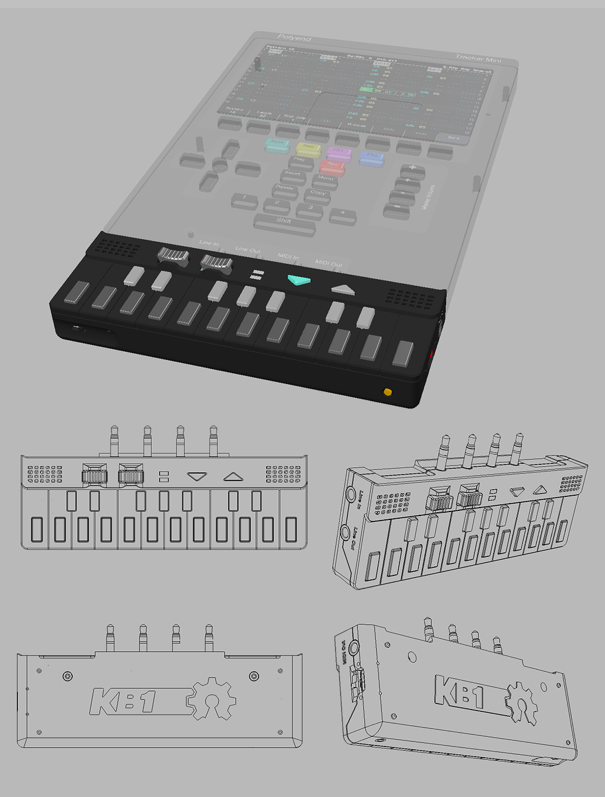
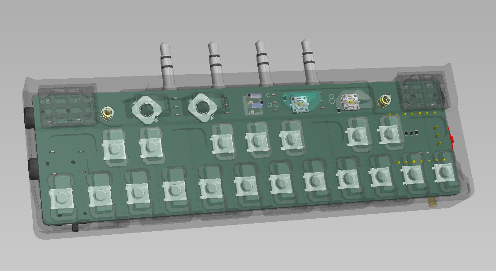
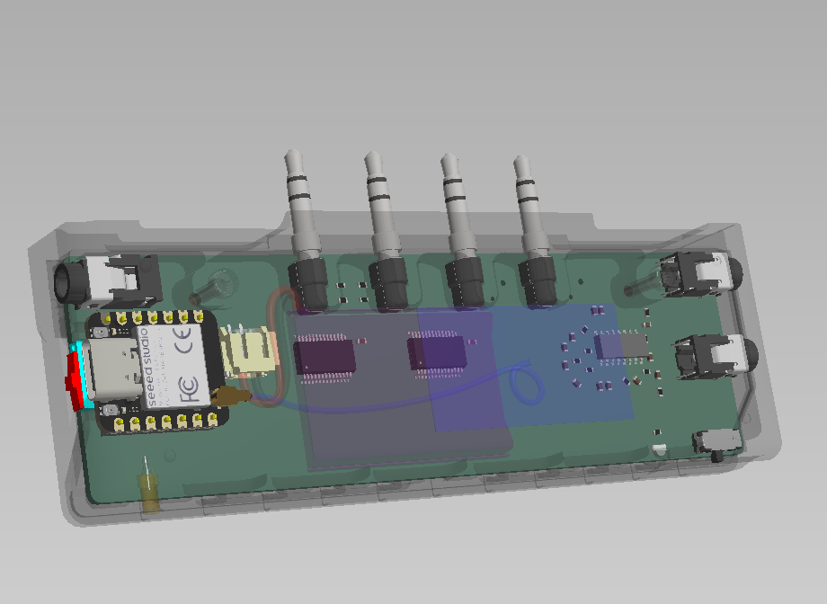

# KB1 - Pocket MIDI Keyboard Controller

### A pocket-sized MIDI keyboard controller with mini speakers for the [Polyend Tracker Mini](https://polyend.com/tracker-mini/)



## ✨ Features

**Hardware:**
- 🎹 **19-Key Keyboard** - Compact chromatic layout with velocity sensitivity
- 🎚️ **Dual Levers** - Configurable MIDI CC controllers with multiple function modes
- 🔘 **Lever Push Buttons** - Additional control options with interpolation
- 👆 **Touch Sensor** - Capacitive touch for expressive control
- 🔊 **Mini Speakers** - Built-in audio playback
- 🔋 **Portable Design** - Fits in your pocket, perfect for Polyend Tracker Mini

**Firmware v1.1:**
- 🎵 **Scale Mode** - Quantize keys to Major, Minor, Pentatonic, Blues, and modal scales
- 🎸 **Chord Mode** - Play full chords with each key (10 types: Major, Minor, Diminished, Augmented, Sus2/4, Power, Major7, Minor7, Dom7)
- 🎶 **Strum Mode** - Cascade chord notes with configurable timing and velocity spread
- ⚙️ **Configurable Controls** - Customize lever behavior, CC mappings, interpolation curves
- 💾 **8 Preset Slots** - Store complete configurations on-device
- 🔋 **Power Management** - Configurable sleep timers and BLE keepalive
- 📡 **Wireless Configuration** - Web Bluetooth connection for easy setup

**Web Configuration App:**
- 🌐 **Browser-Based** - No drivers or software installation required
- 📱 **Mobile & Desktop** - Responsive design works everywhere
- 🎚️ **12 Performance Sliders** - Real-time MIDI CC control with live mode
- 🎨 **Visual Editor** - Intuitive UI for all settings and parameters
- 💾 **Preset Management** - Save/load unlimited configurations

## 🚀 Getting Started

### 1. Update Firmware (Recommended)

**Download the latest firmware:**
1. Go to [Releases](https://github.com/PocketMidi/KB1/releases)
2. Download `KB1-firmware-v1.1.1.bin` (or latest version)

**Flash using ESPConnect (Chrome/Edge Browser):**
1. Connect KB1 to your computer via USB-C
2. Open [ESPConnect](https://thelastoutpostworkshop.github.io/ESPConnect/) in Chrome or Edge
3. Click **CONNECT** and select your KB1 device
4. Click the upload icon, choose the downloaded .bin file
5. Wait for upload to complete (~30 seconds)
6. Device will restart automatically

> 💡 **Tutorial**: Watch the [ESPConnect video guide](https://youtu.be/-nhDKzBxHiI) for step-by-step instructions

### 2. Configure Your KB1

**Open the web configuration app:**
- 🌐 **[kb1-config.pocketmidi.com](https://kb1-config.pocketmidi.com)** (or your deployment URL)

**First-time setup:**
1. Click **DISCONNECTED** in top-right corner
2. Select "KB1" from Bluetooth pairing dialog
3. Settings load automatically from device
4. Customize keyboard modes, levers, scales, and more
5. Click **Save to Device** to apply changes

**Try Performance Sliders:**
- Switch to **SLIDERS** tab
- Rotate mobile device to landscape for fullscreen live mode
- Control 12 customizable MIDI CC sliders in real-time

## 📖 Documentation

- **[Configuration App Guide](KB1-config/README.md)** - Complete web app documentation
- **[Firmware Development](firmware/README.md)** - Build and development setup
- **[Hardware Design](hardware/)** - Schematics and PCB files

## 🛠️ Advanced: Build from Source

**Firmware:**
```bash
cd firmware
pio run --target upload
```

**Web App:**
```bash
cd KB1-config
npm install
npm run build
```

See respective READMEs for detailed build instructions.

## 📷 Gallery




## Licensing Summary

- **Software & firmware**: MIT License (see LICENSE)
- **Hardware designs**: CERN Open Hardware Licence v2 – Strongly Reciprocal (see hardware/LICENSE-CERN-OHL-S.txt)

---

**Built with ❤️ for the Polyend Tracker Mini community**

