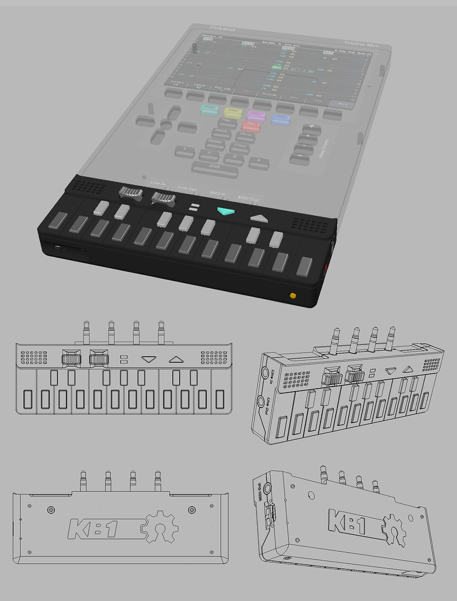
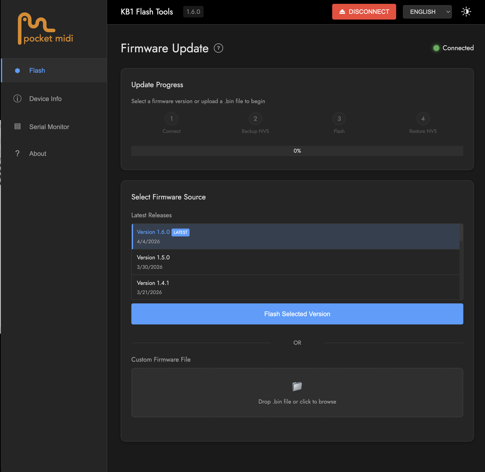
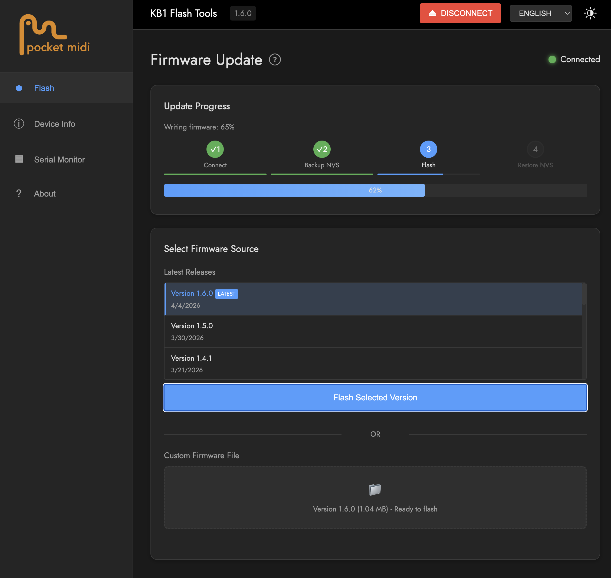
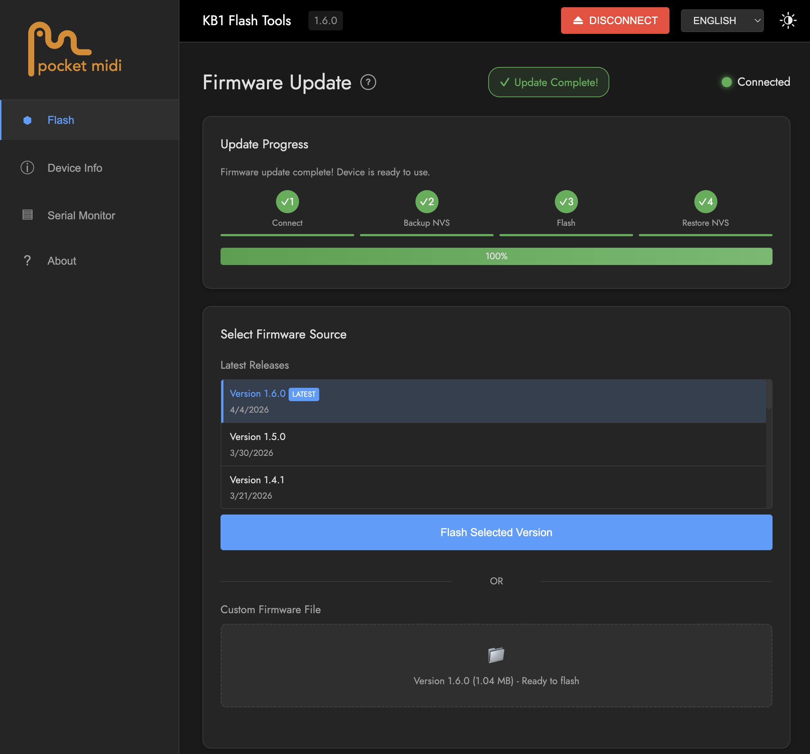
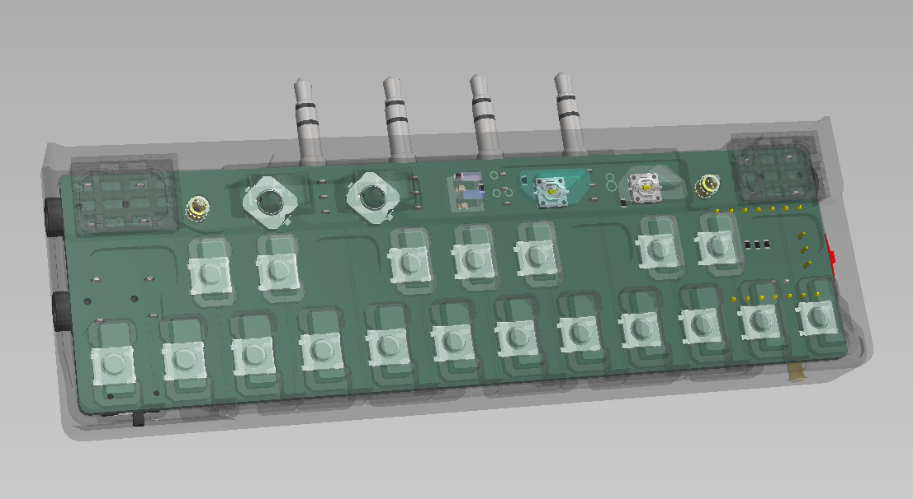
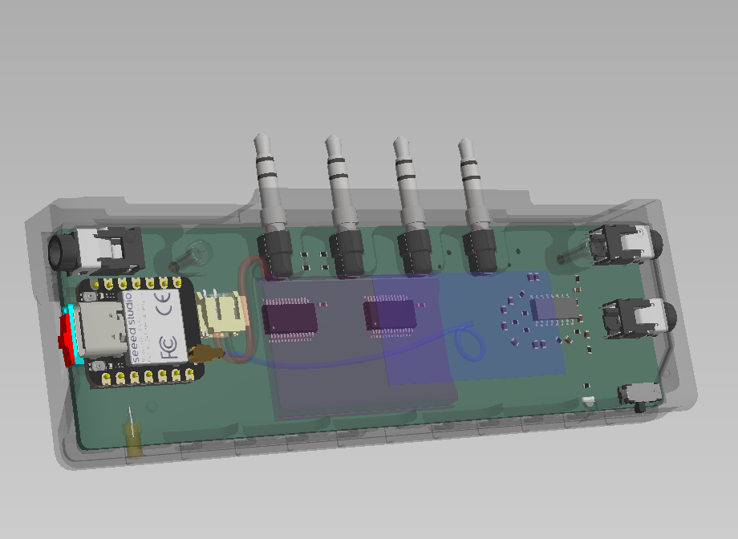

# KB1 - Pocket MIDI Keyboard Controller

A pocket-sized, feature-rich MIDI keyboard controller designed for the [Polyend Tracker Mini](https://polyend.com/tracker-mini/). This first release delivers professional-grade performance controls, wireless configuration, and extensive musical capabilities in an ultra-portable package.



## System Overview

The KB1 system consists of three integrated components working together to provide a complete MIDI performance solution:

**Hardware**
- 19-key velocity-sensitive keyboard with dual operating modes (Scale/Chord)
- 2 analog levers with push buttons for expressive control
- Capacitive touch sensor for additional expression
- Built-in mini speakers for audio monitoring
- ESP32-based with Bluetooth Low Energy connectivity
- Rechargeable battery with intelligent power management

**Firmware** ([details](firmware/README.md))
- Dual keyboard modes: Scale (quantized to musical scales) and Chord (10 chord types with chord/strum options)
- Fully configurable controls with advanced interpolation curves and function modes
- 12 real-time performance sliders (CC 51-62) with bipolar/unipolar and momentary/latched modes
- 8 on-device preset slots for storing complete configurations
- Wireless BLE configuration and standard MIDI output

**Web Configuration App** ([details](https://github.com/PocketMidi/KB1-config))
- Browser-based configuration tool (no installation required)
- Real-time parameter editing over Bluetooth Low Energy
- 12-slider performance interface with mobile live mode
- Preset management with unlimited browser-stored configurations
- Works on desktop and mobile (Chrome, Edge, Opera)

## Quick Start

### 1. Flash Firmware to Your Device

**Flash using the KB1 Web Flash Tool (Recommended — No Tools Required):**

1. **Connect KB1** to your computer via USB-C
2. **Open the flash tool** in Chrome or Edge: [https://pocketmidi.github.io/KB1-flash/](https://pocketmidi.github.io/KB1-flash/)
3. **Click CONNECT** and select your KB1 device from the serial port dialog

   

4. **Select a firmware version** from the Latest Releases list (the newest is pre-selected) and click **Flash Selected Version**
   - The tool automatically backs up your NVS settings before flashing and restores them after
   - You can also drag and drop a custom `.bin` file if needed

   

5. **Wait for completion** — all four steps (Connect → Backup NVS → Flash → Restore NVS) will turn green

   

### 2. Enable Bluetooth on Your KB1

**IMPORTANT**: Before connecting, ensure Bluetooth is enabled on your device.

**To enable Bluetooth:**
1. **Cross-lever gesture**: Push both levers toward each other (left lever → right, right lever → left) and **hold for 3 seconds**
2. **Watch for progressive LED feedback:**
   - Octave arrow LEDs turn ON immediately (gesture detected)
   - Pink + blue LEDs pulse with increasing speed as you hold
   - **All LEDs turn OFF** = activation complete, release levers

Repeat the same gesture anytime to toggle Bluetooth on/off.

**Note:** The gesture is automatically cancelled if any keyboard key is pressed, preventing accidental triggers during performance.

### 3. Configure Over Bluetooth

**Launch the web app**: [https://pocketmidi.github.io/KB1-config](https://pocketmidi.github.io/KB1-config)

1. Click **DISCONNECTED** (top-right) and pair with "KB1"
2. Settings load automatically from device
3. Configure keyboard modes, controls, scales, and performance sliders
4. Click **Save to Device** to persist changes to flash memory

**Performance Sliders**: Switch to the SLIDERS tab for 12 real-time CC controllers. On mobile, rotate to landscape for fullscreen live mode.

**iOS Users**: Safari does not support Web Bluetooth. Download V Browser from the App Store to access the web configuration app on iOS devices. Note: When using V Browser, live mode automatically compensates for touch offset, and you may see one slider grayed out (11 remain active) - this is normal behavior for optimal touch accuracy.

## Documentation

- [Configuration App Guide](https://github.com/PocketMidi/KB1-config) - Complete web app documentation with usage examples
- [Firmware Documentation](firmware/README.md) - Technical details, features, and build instructions
- [Hardware Design](hardware/) - Schematics and PCB files

## Building from Source

**Firmware** (PlatformIO):
```bash
cd firmware
pio run --target upload
```

**Web App** (Vite + Vue 3):
```bash
cd KB1-config
npm install
npm run build
```

Detailed build instructions are available in the respective README files.

## Gallery




## License

- **Software & Firmware**: MIT License (see LICENSE)
- **Hardware Designs**: CERN Open Hardware Licence v2 – Strongly Reciprocal (see hardware/LICENSE-CERN-OHL-S.txt)

---

Built for the Polyend Tracker Mini community

