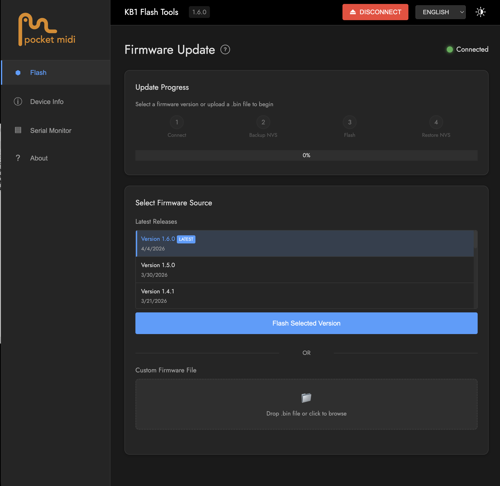
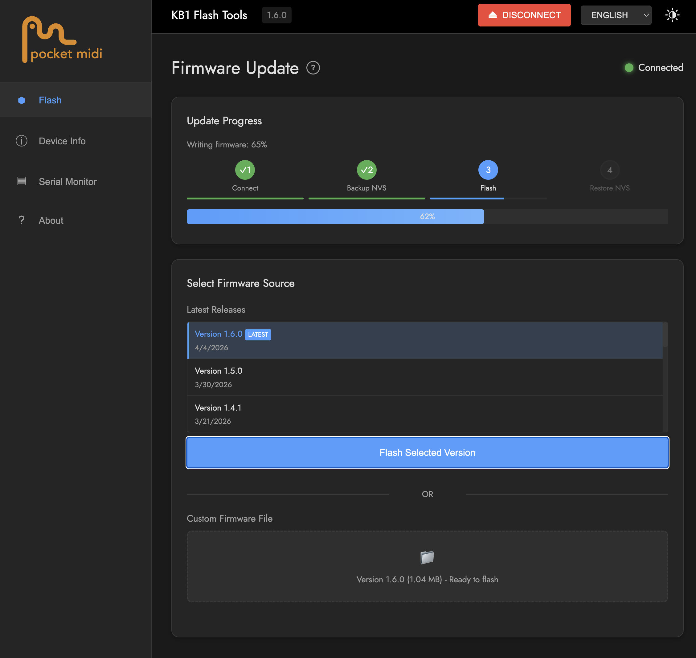
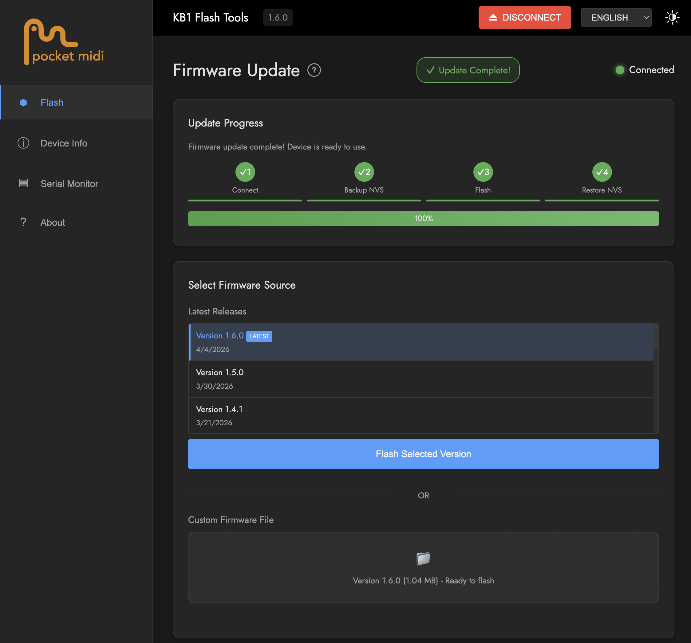

# KB1 - Pocket MIDI Keyboard Controller

KB1 is a compact MIDI keyboard controller built around the Polyend Tracker Mini. It connects over Bluetooth Low Energy and is configured via a browser-based web app.


## System Overview

**Hardware**
- 19-key keyboard (digital switches, no velocity)
- 2 analog levers with integrated push buttons
- 2 capacitive touch inputs
- 2× 8Ω 1W speakers (PAM8406 Class-D amplifier)
- XIAO ESP32-S3 MCU with BLE and USB-C
- 420mAh Li-ion battery, charged via USB-C (requires USB enumeration — dumb chargers do not work)

**Firmware** ([details](firmware/README.md))
- Scale mode: note output quantized to a selectable musical scale
- Chord mode: 10 chord types with strum, voicing (1–3 octave expansion), and swing
- Press controls: configurable CC, pitch bend (CC 208), or sustain (CC 209)
- Lever and touch controls: configurable CC output with interpolation curves
- Hardware CCs to step through scale type, chord type, and root note (CC 204–206)
- 12 performance sliders (CC 51–62): bipolar/unipolar, momentary/latched
- 8 on-device preset slots
- BLE MIDI and Serial MIDI output

**Web Configuration App** ([details](https://github.com/PocketMidi/KB1-config)) [](https://cloud.umami.is/analytics/us/share/X00Oso9T1qydknsS)
- Runs in Chrome, Edge, or Opera — no installation required
- Connects over Web Bluetooth
- Settings load from and save to device over BLE
- 12-slider live performance interface (landscape fullscreen on mobile)
- Preset management stored in browser

## Quick Start

### 1. Flash Firmware

1. **Connect KB1** to your computer via USB-C
2. **Open the flash tool** in Chrome or Edge: [https://pocketmidi.github.io/KB1-flash/](https://pocketmidi.github.io/KB1-flash/)
3. **Click CONNECT** and select your KB1 from the serial port dialog

   

4. **Select a firmware version** from the list (latest is pre-selected) and click **Flash Selected Version**
   - NVS settings are backed up before flashing and restored after
   - You can also drag and drop a local `.bin` file

   

5. **Wait for all four steps to complete**: Connect → Backup NVS → Flash → Restore NVS

   

The flash tool also includes:
- **Device Info** — firmware version, BLE name, battery status, and NVS values
- **Serial Monitor** — live serial output from the device

### 2. Enable Bluetooth

Bluetooth is off by default. To toggle it:

1. Push both levers toward each other (left lever right, right lever left) and hold for 3 seconds
2. LED feedback during hold:
   - Octave arrow LEDs turn on immediately
   - Pink + blue LEDs pulse with increasing speed
   - All LEDs turn off = toggle complete, release levers

The gesture is cancelled if any key is pressed during the hold.

### 3. Configure

Open [https://pocketmidi.github.io/KB1-config](https://pocketmidi.github.io/KB1-config) in Chrome, Edge, or Opera.

1. Click **DISCONNECTED** (top-right) and pair with "KB1"
2. Settings load automatically from the device
3. Edit settings and click **Save to Device**

**Sliders tab**: 12 CC controllers (CC 51–62). On mobile, rotate to landscape for fullscreen mode.

**iOS**: Safari does not support Web Bluetooth. Use V Browser (App Store). In V Browser, live mode compensates for touch offset automatically; one slider may appear grayed out (11 remain active).

## Documentation

- [Configuration App Guide](https://github.com/PocketMidi/KB1-config)
- [Firmware Documentation](firmware/README.md)
- [Hardware Design](hardware/)

## Building from Source

**Firmware** (PlatformIO):
```bash
cd firmware
pio run --target upload
```

**Web App** (Vite + Vue 3):
```bash
cd KB1-config
npm install
npm run build
```

## Gallery


## License

- **Software & Firmware**: MIT License (see LICENSE)
- **Hardware Designs**: CERN Open Hardware Licence v2 – Strongly Reciprocal (see hardware/LICENSE-CERN-OHL-S.txt)

