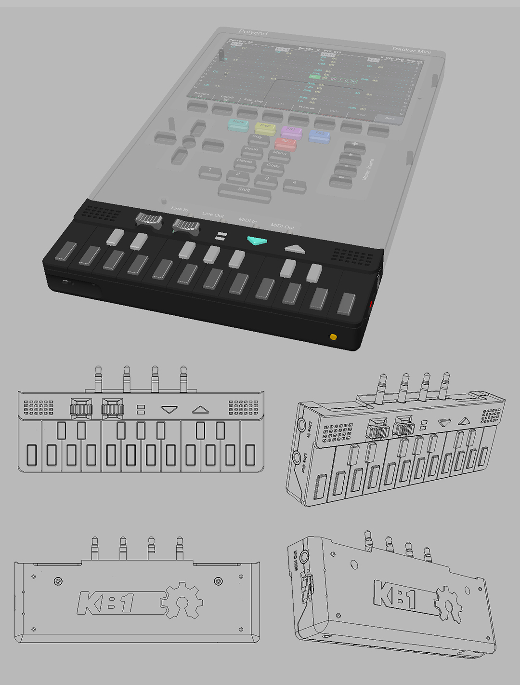
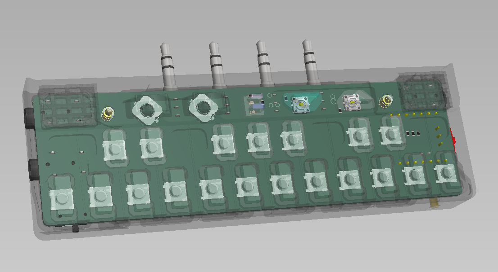
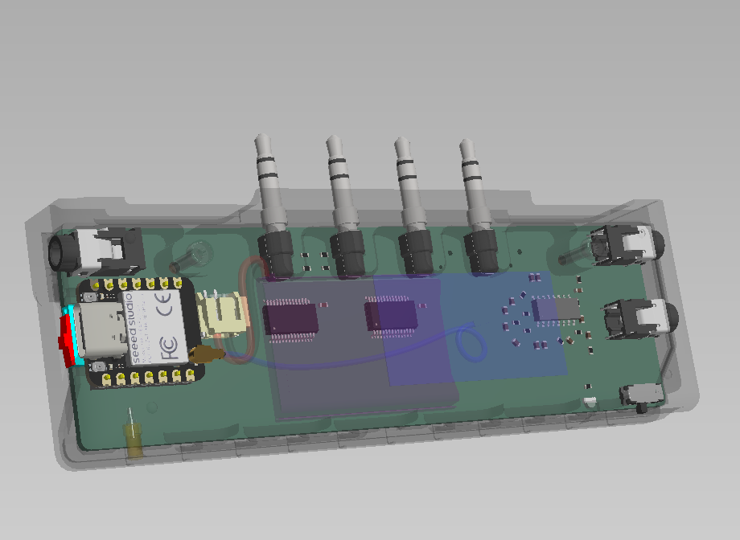

# ***KB1*** - Pocket MIDI Keyboard Controller

***KB1*** is a compact MIDI keyboard controller built specifically for the Polyend Tracker Mini. It is configured via a browser-based web app connected via Bluetooth Low Energy.

## System Overview

**Hardware**
- 19-key keyboard
- 2 levers with integrated push buttons
- 1 capacitive touch input
- 2× 8Ω 1W speakers
- XIAO ESP32-S3 MCU with BLE and USB-C
- 420mAh Li-ion battery, charged via USB-C 

**Firmware** ([details](firmware/README.md))
- Lever, press, and touch controls: configurable CC output and parameter-specific behavior
- Scale mode: note output quantized to a selectable musical scale
- Chord mode: selectable chord types, Block/Strum playback, and 1–3 octave range
- Arp Mode: User defined arpeggiator
- 8 on-device preset slots
- Serial MIDI output

**Web Configuration App** ([details](https://github.com/PocketMidi/KB1-config)) 
- Mobile first design
- Runs in Chromium based browsers (**iOS**: Safari does not support Web Bluetooth. [V Browser ](https://vbrowser.co) recommended for iOS)
- Connects over Web Bluetooth
- Settings load from and save to device over BLE
- 12-slider live performance interface (landscape fullscreen on mobile)
- Preset management stored in browser

## Documentation

- [KB1 Studio User Guide and Tools](https://pocketmidi.github.io/KB1-studio/): Hardware setup, charging, Tracker configuration, firmware updates, and instrument building.
- [Configurator User Guide](https://github.com/PocketMidi/KB1-config/blob/main/docs/USER_GUIDE.md): Current app settings, presets, and performance sliders.
- [Firmware README](firmware/README.md): Development builds and complete release images.
- [Hardware Design and Assembly](hardware/README.md): Electronic and mechanical files.
- [Contributing](CONTRIBUTING.md): Shared conventions, documentation ownership, and release validation.

Each repository README covers its own setup. Detailed user instructions live in the guides above rather than repeated copies.

## Building from Source

- [Firmware build and upload](firmware/README.md#development-build); use the [complete-image builder](firmware/README.md#complete-release-images) for distributable firmware.
- [Configurator development](https://github.com/PocketMidi/KB1-config#development).
- [Studio development](https://github.com/PocketMidi/KB1-studio#development--deployment).

## Gallery

## License

- **Software & Firmware**: MIT License (see LICENSE)
- **Hardware Designs**: CERN Open Hardware Licence v2 – Strongly Reciprocal (see [hardware license](hardware/LICENSE.txt))
