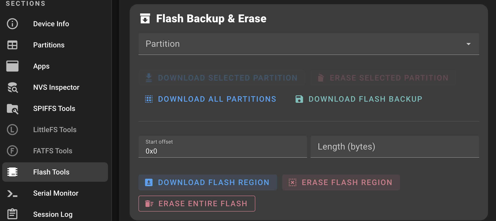
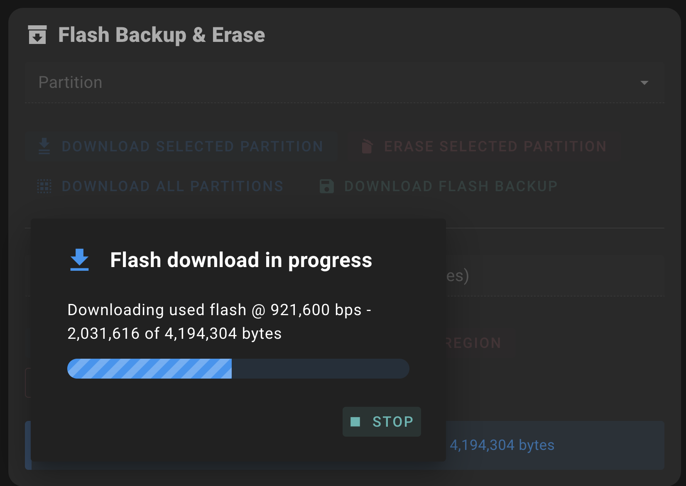
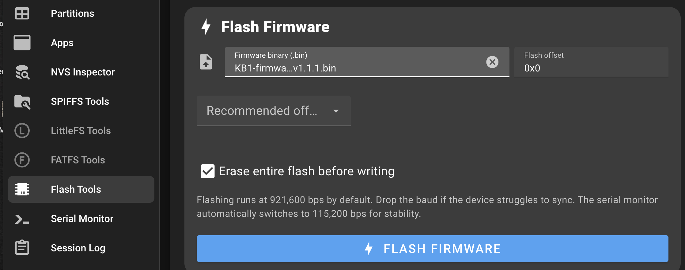
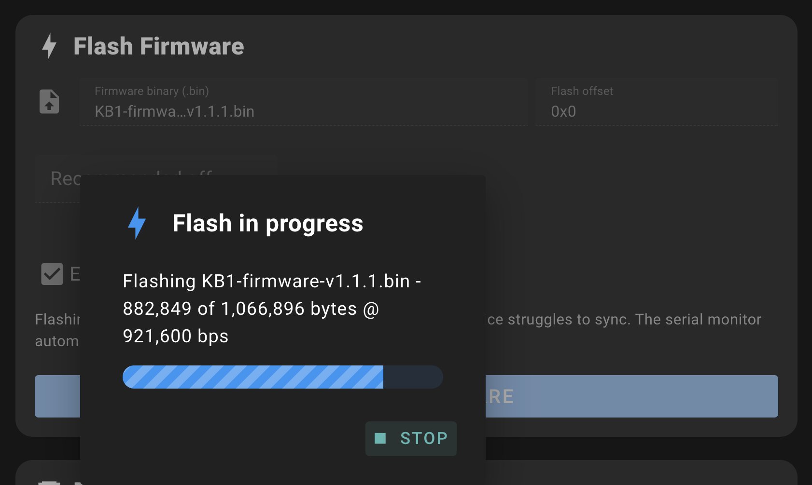
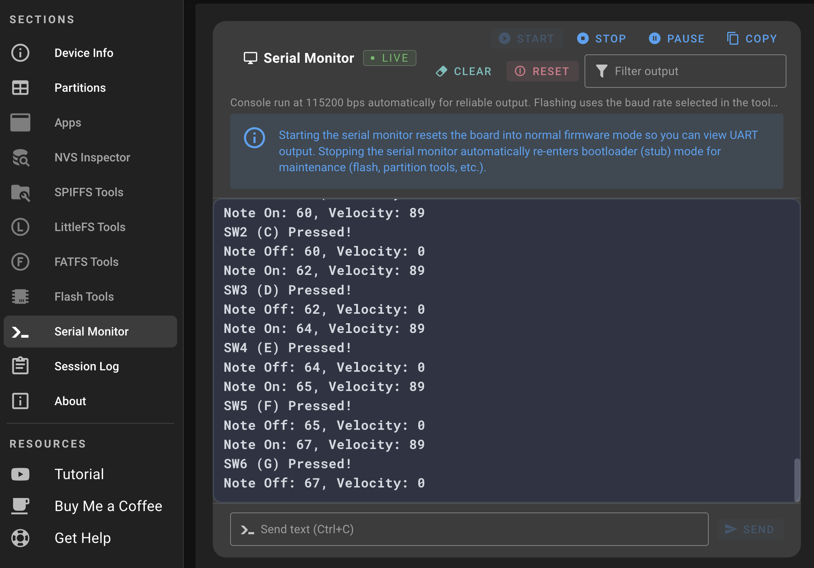

# KB1 Firmware v1.1.1 Release Notes

## Overview

This is the first production-ready release of KB1 firmware, delivering a complete embedded MIDI controller system for the ESP32-S3 hardware platform. The firmware implements dual-mode keyboard operation, comprehensive analog control processing, wireless BLE MIDI communication, and full device configuration via Bluetooth Low Energy.

## Hardware Support

### Input Processing

**Keyboard Array** — Full capacitive keyboard matrix scanning with dual operating modes:
- Scale mode: Quantized note output across seven musical scales
- Chord mode: Multi-note triggering with ten chord types and optional strum
- Real-time mode switching via BLE configuration
- Octave shift control (-2 to +2)

**Analog Controls** — Multi-channel ADC sampling for continuous controllers:
- 4 performance sliders with individual CC mapping
- 2 analog levers (4 axes total) with interpolation curves and value modes
- 2 lever push buttons with programmable behavior
- 1 capacitive touch sensor with adjustable threshold

**Power Management** — Configurable sleep states for battery operation:
- Light sleep: 30-300s timeout
- Deep sleep: 120-1800s timeout
- Automatic wake on control interaction

### Firmware Architecture

**BLE Stack Management** — Serial output throttling prevents buffer overflow during simultaneous control input. Heavy slider and lever usage maintains stable communication without dropped messages or delays.

**MIDI Note Tracking** — Chord note management system properly pairs note-on/note-off events across mode changes, octave shifts, and rapid chord transitions. Prevents stuck notes and ensures clean voice management.

## Technical Specifications

**Hardware Platform:**
- Target MCU: ESP32-S3 (Seeed Xiao ESP32S3)
- Flash Usage: 29.9% (1,002,496 bytes / 3,342,336 bytes)
- RAM Usage: 15.6% (51,092 bytes / 327,680 bytes)
- Build Framework: PlatformIO with Arduino core

**BLE Service Implementation:**
- MIDI Service: Standard BLE MIDI profile for note/CC transmission
- Configuration Service: Custom GATT service for parameter control
- Preset Service: 8-slot storage system with flash persistence
- Security: Optional pairing with secure bonding support

**Key Characteristics:**
- Keyboard Settings: `UUID: 4a8c9f2e-1b7d-4e3f-a5c6-d7e8f9a0b1c1`
- Chord Settings: `UUID: 4a8c9f2e-1b7d-4e3f-a5c6-d7e8f9a0b1c2`
- Lever Configuration: Individual UUIDs per lever and axis
- Power Management: Dedicated characteristic for sleep timing

**Default Configuration:**
- Keyboard mode: Scale (Major scale, root C)
- Chord type: Major (when in chord mode)
- Strum: Disabled
- Strum speed: 45ms
- Velocity spread: 8%
- Sleep timeouts: 120s light, 300s deep
- BLE keep-alive: 60s

## Installation

### Method 1: ESPConnect (Recommended)

No toolchain installation required. Flash firmware directly from your web browser using Web Serial API.

**Requirements:** Chrome, Edge, or Opera browser with Web Serial API support.

**Step-by-Step Instructions:**

1. **Connect Hardware:**
   - Plug KB1 into your computer via USB-C cable
   - Navigate to [ESPConnect](https://thelastoutpostworkshop.github.io/ESPConnect/)
   - Click **CONNECT** button
   - Select your KB1 device from the browser's serial port dialog

2. **Backup Your Flash (Important!):**
   - Click **Flash Tools** in the left sidebar
   - Click **DOWNLOAD FLASH BACKUP** button
   - Save the backup file to a safe location (in case you need to restore)
   
   
   
   

3. **Load Firmware File:**
   - In the "Firmware binary (.bin)" field, click to browse
   - Select `KB1-firmware-v1.1.1.bin` from this release
   - Verify "Flash offset" is set to `0x0` (default)
   
   

4. **Flash the Firmware:**
   - **Important:** Check the box for **"Erase entire flash before writing"**
   - Click the blue **FLASH FIRMWARE** button
   - Confirm the flash operation when prompted
   - Wait for the process to complete (typically 30-60 seconds)
   
   
   
   

5. **Verification (Optional):**
   - After flashing completes, you can verify operation:
   - Click **Serial Monitor** in the left sidebar
   - Click **START** to begin monitoring
   - Press keys on your KB1 to see MIDI note events in real-time
   - This confirms the firmware is running correctly
   
   

6. **Finish:**
   - Disconnect from ESPConnect
   - Proceed to "First Time Setup" section below to enable Bluetooth

### Method 2: PlatformIO (Development Environment)

Build and flash from source using the PlatformIO toolchain.

```bash
cd firmware
pio run --target upload --environment seeed_xiao_esp32s3
```

**Requirements:** PlatformIO Core or PlatformIO IDE extension for VS Code.

## First Time Setup

**IMPORTANT: Enable Bluetooth Before Connecting**

After flashing firmware, you must enable Bluetooth to connect with the configuration app:

1. **Hold both octave buttons** (up + down) simultaneously for **3 seconds**
2. **Watch for LED confirmation:**
   - Fast blinking (pink + blue LEDs) = **Bluetooth enabled** ✓
   - Slow blinking = Bluetooth disabled
3. Repeat the same process anytime to toggle Bluetooth on/off

**Note:** Without enabling Bluetooth, the web configuration app will not detect your device.

## Configuration

The KB1 web configuration app provides wireless access to all firmware settings via Bluetooth Low Energy.

**Access:** [pocketmidi.github.io/KB1-config](https://pocketmidi.github.io/KB1-config)

**Chord Settings Configuration:**
- Select chord type from dropdown menu
- Toggle between chord and strum modes
- Adjust strum speed with real-time slider feedback
- Set velocity spread for dynamic voicing
- Changes take effect immediately on connected device

**Other Settings:**
- Scale selection and root note configuration
- Lever CC mapping and interpolation curves
- Touch sensor threshold adjustment
- Power management timing
- Preset save/load operations

## Documentation

- [Firmware README](../README.md) - Complete firmware architecture and feature documentation
- [Preset Implementation Guide](PRESET_IMPLEMENTATION.md) - BLE protocol and preset structure
- [Config App Documentation](../KB1-config/README.md) - Web app user guide

## Complete Feature Set

This first production release implements full hardware controller functionality across all subsystems.

### Keyboard Hardware

**Operating Modes:**
- Scale Mode: Quantized note output with musical scale selection
- Chord Mode: Multi-note chord triggering per key press

**Scale Types** — Seven musical scales:
- Major, Minor, Dorian, Phrygian, Lydian, Mixolydian, Blues
- Selectable root note (C through B, including sharps)
- Natural/Compact key mapping options

**Chord Types** — Ten chord voicings:
- Major, Minor, Diminished, Augmented
- Sus2, Sus4, Power
- Major7, Minor7, Dominant7

**Chord Performance Controls:**
- Strum mode: 5-100ms configurable note delay for cascading articulation
- Velocity spread: 0-100% dynamic voicing (exponential reduction per note)
- Seamless mode switching via configuration app

**General Keyboard Controls:**
- Octave shift: -2 to +2 range
- Velocity sensitivity from hardware input
- MIDI channel assignment

### Analog Control Hardware

**Slider Array** — Four analog sliders with full MIDI CC mapping:
- Individual CC number assignment (0-127)
- Configurable output range per slider
- Bipolar/unipolar operation modes
- Momentary/latched behavior options

**Lever Controls** — Two analog joysticks (4 total axes) with advanced control options:
- Per-axis CC number assignment
- Configurable value ranges (0-127)
- Step quantization for discrete values
- Function modes: Uni/bi-directional, momentary, toggle
- Value modes: Jump, hook, pickup, latch
- Interpolation control: onset/offset timing (0-5000ms)
- Curve options: Linear, S-Curve, Logarithmic

**Lever Push Buttons** — Two push button inputs with dedicated CC mapping:
- Independent CC assignment per button
- Function modes: Trigger, momentary, toggle
- Interpolation support with configurable curves

**Capacitive Touch Sensor** — Single touch pad with adjustable sensitivity:
- Configurable threshold (0-65535, default: 24000)
- CC output with range control
- Trigger/momentary modes

### Power Management Hardware

**Sleep Mode Implementation:**
- Light sleep: 30-300s configurable timeout
- Deep sleep: 120-1800s configurable timeout
- Automatic wake on any control interaction
- Current draw reduction during sleep states

**BLE Connection Management:**
- Configurable keep-alive timeout (30-600s)
- 10-minute firmware grace period
- Automatic reconnection handling
- Connection state reflected via LED feedback

### Bluetooth Low Energy Stack

**MIDI Profile:**
- Standard BLE MIDI implementation
- Compatible with iOS, macOS, Windows, Linux
- Low-latency note triggering
- Reliable CC message delivery

**Configuration Service:**
- Custom GATT service for wireless configuration
- Real-time parameter updates
- Bidirectional communication (read/write characteristics)
- Secure pairing support with bonding

**Preset Management:**
- 8 on-device preset slots
- Complete configuration storage per preset
- Non-volatile flash storage
- BLE-based save/load operations

### System Stability & Performance

**Serial Output Management** — Throttled debug output prevents buffer overflow during heavy control usage. Internal serial buffer maintained below capacity even with simultaneous slider and lever input.

**BLE Characteristic Management** — Enhanced characteristic update handling ensures reliable parameter synchronization between firmware and configuration app. No dropped updates during rapid setting changes.

**MIDI Note Tracking** — Improved chord note management system properly pairs note-on/note-off events. Prevents stuck notes during rapid chord changes, mode switches, or octave shifts.

**Preset Storage** — Robust save/load implementation with flash wear leveling. All configuration parameters persist across power cycles and firmware updates.

## Support

Found a bug or have a feature request? Open an issue on [GitHub](https://github.com/pocketmidi/KB1/issues).

---

**Compatibility:** ESP32-S3 (Seeed Xiao ESP32S3)  
**Build Date:** February 21, 2026  
**Firmware Size:** 978KB  
**MD5 Checksum:** `cf9e8c7cb036ac68110d425100ac42b8`
